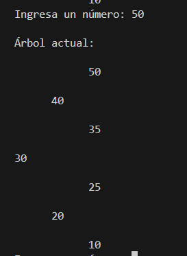

# Proyecto Final – Árbol AVL en Java

**Curso:** Estructuras de Datos  
**Estudiante:** Carlos Eduardo Toj Dardón  
**Catedrático:** Ing. Brandon Chitay  
**Fecha de entrega:** Sábado 17 de mayo

---

## Descripción general

Este programa en Java permite insertar números desde la terminal y los va organizando dentro de un árbol AVL.  
Después de cada inserción, el árbol se muestra actualizado en consola y se balancea automáticamente cuando es necesario.  
No utiliza listas predefinidas, todos los datos se ingresan por el usuario en tiempo real.

---

## Funcionalidades del programa

- Inserción uno por uno desde consola.
- El árbol se auto-balancea aplicando rotaciones cuando es necesario (LL, RR, LR y RL).
- Se imprime visualmente en forma jerárquica, usando sangrías para mostrar la estructura.
- El programa finaliza al escribir `exit` o `-1`.

---
## Estructura del código
- Node: clase que define cada nodo del árbol (valor, altura e hijos).
- AVLTree: clase principal que maneja la inserción, balanceo, rotaciones y visualización del árbol.
- Main: clase que contiene el main() para ejecutar el programa, leer entradas y mostrar resultados.

---

## Link del video en Youtube explicando el código y mostrando como funciona
- https://youtu.be/DmSfBmflqqY

### 🌲 Árbol AVL tras insertar la secuencia: 30, 20, 40, 10, 25, 35, 50, 5

Este es el resultado del árbol balanceado tras insertar varios números.  
Se aplicaron rotaciones internas y el árbol mantuvo su forma equilibrada.

Antes de ingresar el número 5

Después de ingresar el número 5

